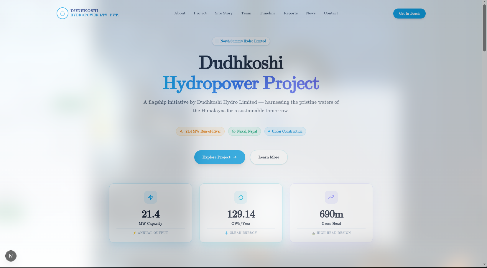

# ⚡ Dudh Koshi Hydropower Project Website

A modern, responsive, and scalable web application developed for the **Dudh Koshi Hydropower Project** using the latest web technologies.
CURRENTLY YOU ARE IN "static-frontend" WHICH MEANS YOU ARE SEEING FRONTEND ONLY (STATICS)
---

## 🚀 Tech Stack

This project is built with:

- Next.js 16+
- React
- Tailwind CSS
- CSS Modules
- ES6+ JavaScript
- Reusable Component-Based Architecture

---

## ✨ Features

- Modern and responsive UI
- Fast performance with Next.js
- Reusable component structure
- SEO-friendly architecture
- Mobile-first design
- Tailwind CSS utility-first styling
- CSS Modules for scoped component styling
- Optimized routing and rendering
- Easy maintenance and scalability

---

## 📂 Project Structure

```bash
src/
├── app/                # Next.js App Router
├── components/         # Reusable UI Components
├── font/               # Custom Fonts
├── pages/              # pages like home page, about us, etc
├── utils/              # Helper Functions
└── data/               # Static Data & Configurations
```

---

## ⚙️ Installation

### Clone the Repository

```bash
git clone https://github.com/aayusofttech/dudhkoshiHP.git
```

### Navigate to the Project Directory

```bash
cd frontend
```

### Install Dependencies

```bash
npm install
```

or

```bash
yarn install
```

---

## 🖥️ Running the Development Server

Start the development server:

```bash
npm run dev
```

or

```bash
yarn dev
```

Open your browser and visit:

```text
http://localhost:3000
```

---

## 🏗️ Build for Production

Create a production build:

```bash
npm run build
```

Start the production server:

```bash
npm run start
```

---

## 🧹 Code Quality

Run linting:

```bash
npm run lint
```

---

## 🎨 Styling Approach

### Tailwind CSS

Used for:

- Responsive layouts
- Utility-based styling
- Faster UI development

### CSS Modules

Used for:

- Component-specific styling
- Style encapsulation
- Avoiding CSS conflicts

---

## ♻️ Component Architecture

The application follows a reusable component-based design pattern:

- Reusable UI Components
- Modular Sections
- Shared Layout Components
- Maintainable Folder Structure
- Scalable Development Workflow

This approach improves code readability, maintainability, and scalability.

---

## 🌐 Deployment

The application can be deployed on:

- Vercel
- Netlify
- AWS
- DigitalOcean
- Docker-based Environments

---

## 👨‍💻 Development Team

Developed and maintained by the project development team.

---

## 📄 License

This project is proprietary and developed specifically for the **Dudh Koshi Hydropower Project**.

**All Rights Reserved.**